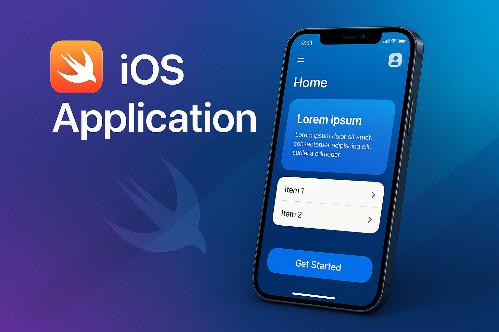

# Swift-iOS-App

## 🇧🇷 Português

Este repositório contém um aplicativo iOS desenvolvido em Swift. O objetivo é demonstrar as melhores práticas de desenvolvimento de aplicativos móveis, com foco em performance, usabilidade e design moderno.

### 🖼️ Imagem Hero



### Funcionalidades

*   Lista de itens interativa
*   Navegação intuitiva
*   Design responsivo

### Como Rodar o Projeto

1.  Clone o repositório:
    ```bash
    git clone https://github.com/galafis/Swift-iOS-App.git
    ```
2.  Navegue até o diretório do projeto:
    ```bash
    cd Swift-iOS-App
    ```
3.  Abra o projeto no Xcode e execute.

## 🇬🇧 English

This repository contains an iOS application developed in Swift. The goal is to demonstrate best practices in mobile application development, focusing on performance, usability, and modern design.

### 🖼️ Hero Image


### Features

*   Interactive item list
*   Intuitive navigation
*   Responsive design

### How to Run the Project

1.  Clone the repository:
    ```bash
    git clone https://github.com/galafis/Swift-iOS-App.git
    ```
2.  Navigate to the project directory:
    ```bash
    cd Swift-iOS-App
    ```
3.  Open the project in Xcode and run it.

## Autor

Gabriel Demetrios Lafis

## License

This project is licensed under the MIT License - see the [LICENSE](LICENSE) file for details.
